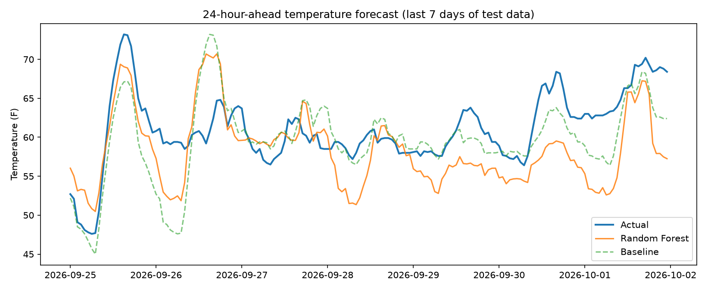

# Temperature Forecasting with Machine Learning

Predicts the temperature 24 hours ahead for Troy, NY using two years of hourly weather data. Compares linear regression and a random forest against a simple baseline, using a time-based train/test split to avoid data leakage.

## Data
Hourly temperature, humidity, wind speed, and pressure from the [Open-Meteo Historical Weather API](https://open-meteo.com/), covering about two years ([start date] to [end date], [X] rows).

## Approach
- **Target:** temperature 24 hours after each observation
- **Features:** current weather, temperatures from 3, 6, and 24 hours ago, and hour of day and day of year (encoded with sine and cosine)
- **Split:** first 80% of the timeline for training and last 20% for testing, with no shuffling
- **Models:** baseline (same as now), linear regression, random forest
- **Metrics:** MAE and RMSE in degrees Fahrenheit

## Results
Lower is better.

| Model | MAE (F) | RMSE (F) |
|---|---|---|
| [Best model] | [X.XX] | [X.XX] |
| [Second model] | [X.XX] | [X.XX] |
| Baseline (same as now) | [X.XX] | [X.XX] |

**Key finding:** [one or two sentences, for example which model won and by how much compared with the baseline].

## Limitations
One location, about two years of data, no hyperparameter tuning, and no external forecast data. Results may not generalize to other places.

## How to run
1. Create and activate a virtual environment (`python3 -m venv venv`, then `source venv/bin/activate`)
2. `pip install pandas requests scikit-learn matplotlib`
3. `python3 fetch_history.py` to download the data
4. `python3 train.py` to train and evaluate (saves `results.csv` and `forecast_plot.png`)

## What I learned
Framing a prediction problem, avoiding data leakage with a time-based split, comparing models against a baseline, and reporting results honestly.